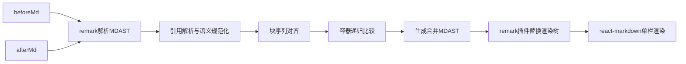

# Markdown 单栏 AST Diff 技术方案

## 技术口径
- 比较输入为 `beforeMd` 与 `afterMd`；页面只负责取“目标修订”和修订序列中紧邻的上一版，不假设修订号连续。
- 比较的是渲染语义：`*文本*` 与 `_文本_`、列表符号或空白排版变化不产生差异；块移动首版按删除加新增处理。
- 首版覆盖顶层块、嵌套列表项、GFM 表格行和 fenced code 行；段落、标题等内容修改显示为相邻的删除块与新增块，不做词级 Diff。
- Diff 为纯展示能力，现有 `Revision.snapshot.bodyMd` / `OverviewRevision.snapshot.bodyMd` 已足够，不新增 IPC 或 Rust 逻辑。

## 核心实现
- 新建 [`src/components/markdown-diff/parseMarkdown.ts`](src/components/markdown-diff/parseMarkdown.ts)：使用 `unified + remark-parse + remark-gfm` 解析；先把引用式链接/图片按各自 definition 解析为自包含节点，避免合并两棵树时 identifier 冲突。
- 新建 [`src/components/markdown-diff/normalizeNode.ts`](src/components/markdown-diff/normalizeNode.ts)：递归去除 `position/data`，保留节点类型、链接目标、标题层级、列表属性、表格结构、代码语言和正文，产出确定性语义签名；纯文本仅用于变更区间内的相似度配对，不作为相等依据。
- 新建 [`src/components/markdown-diff/alignSequence.ts`](src/components/markdown-diff/alignSequence.ts)：先用 Myers/LCS 按语义签名锚定完全相同节点，再在相邻未匹配区间内做有上限的最小成本配对；只有兼容容器才递归，超限时保守降级为整块删除/新增，避免平方复杂度拖慢长文档。
- 新建 [`src/components/markdown-diff/buildDiffTree.ts`](src/components/markdown-diff/buildDiffTree.ts)：生成一棵合并后的标准 MDAST：equal 采用新节点一次，removed 采用旧节点并写入 `data.hProperties[data-diff=removed]`，added 采用新节点并标记 added；相邻前后块共享稳定的 `data-diff-group`。
- 容器策略：
  - 同类型列表递归比较 `listItem`；嵌套列表继续递归，ordered list 给合并后的条目保留显式原序号，避免删除项扰乱编号。
  - 同列结构表格递归比较 `tableRow`，单元格变化标整行前后版本；列数、对齐或表头结构变化时整表删除/新增。
  - 相同语言的代码块调用 `diffLines`，生成 `CodeLineOp[]`；语言或 meta 改变时整块删除/新增。
  - blockquote 递归顶层块；HTML、图片、分隔线等按原子节点处理。
- 新建 [`src/components/markdown-diff/MarkdownDiffBody.tsx`](src/components/markdown-diff/MarkdownDiffBody.tsx)，公开稳定接口 `before: string`、`after: string`。组件用 `useMemo` 构造 DiffPlan；单个 `react-markdown` 实例通过自定义 remark 插件返回合并 MDAST，保持文档上下文、列表连续性和引用安全。代码块由自定义 `code` renderer 按 DiffPlan 中的行操作输出 span；不要按空行切 Markdown，也不要为每个片段启动独立 Markdown 渲染器。
- 抽取共享解析配置，使 [`src/components/MarkdownBody.tsx`](src/components/MarkdownBody.tsx) 与 Diff 解析器使用同一套 GFM 选项；删除节点中的链接在合并阶段去活化，避免旧内容仍可点击。

## 工程接入
- 在 [`src/features/design/components/ItemDetailPage.tsx`](src/features/design/components/ItemDetailPage.tsx) 和 [`src/features/overview/components/OverviewPage.tsx`](src/features/overview/components/OverviewPage.tsx) 仅计算前后 `bodyMd` 并调用 `MarkdownDiffBody`；“何时显示 Diff”的页面交互不进入算法组件。
- 在 [`src/styles.css`](src/styles.css) 增加 `.md-diff-body` 作用域样式：主题变量控制增删背景和边框，左侧同时显示 `+/-` 标记，不能只靠颜色；代码行使用块级 span，保持现有横向滚动。
- 新增运行依赖 `unified`、`remark-parse`、`mdast-util-to-string`、`unist-util-visit`、`diff`，开发依赖 `@types/mdast`；同步 [`config/dependency-whitelist.json`](config/dependency-whitelist.json) 和 `package.json`。继续复用已有 `react-markdown`、`remark-gfm`，不引入编辑器或完整 Diff UI 组件。（2026-09-03 偏差留痕：用户指令跳过测试，未引入 `vitest`。）
- 实施前先修订 [`docs/design/05-detailed-design/ui/pages/item-detail.md`](docs/design/05-detailed-design/ui/pages/item-detail.md)、[`docs/design/05-detailed-design/ui/pages/project-overview.md`](docs/design/05-detailed-design/ui/pages/project-overview.md)、[`docs/design/05-detailed-design/ui/patterns.md`](docs/design/05-detailed-design/ui/patterns.md) 与 [`docs/design/05-detailed-design/ui/README.md`](docs/design/05-detailed-design/ui/README.md)，移除当前“无 diff”基线并记录纯前端 AST 路径。

## 验证重点
- 纯算法测试覆盖：完全相同、空文档、块增删改/移动、语法不同但渲染等价、嵌套有序/无序列表、任务列表、表格行和列结构变化、代码行及语言变化、引用链接、原始 HTML、超长未匹配区间降级。（2026-09-03 用户指令跳过测试；改为浏览器实览 + Node 性能探针覆盖同等场景。）
- 合并树测试断言顺序、`data-diff` 标记、ordered list 序号和输入树不被修改；渲染测试断言仅有一个 Markdown 文档上下文、删除链接不可交互、代码行 class 正确。
- 补强 [`src/api/mock/fixtures.ts`](src/api/mock/fixtures.ts) 的条目历史正文差异后，运行 `npm run check`，再分别在浏览器 mock 与 Tauri WebView 中检查 GFM 表格、代码横向滚动、明暗主题和长文档性能。已实测：FR-001 r2 视图（代码行 -/+、紧凑列表项整项标记且序号保持、删除链接 `pointer-events: none`）、概览 r2 视图（新增节整体标记）、r1 纯快照与切回当前、明暗主题配色；Node 探针：500 块微改 185ms、3000 块（patience 降级）620ms、400+400 无锚点 30ms、一致短路 null。

## 明确不做
- 不比较 HTML 字符串或 DOM；不按空行/源码行拆普通 Markdown。
- 不做词级、字符级、块移动识别、编辑器能力或后端预计算。
- 不在本方案中规定页面按钮、默认视图或切换交互。