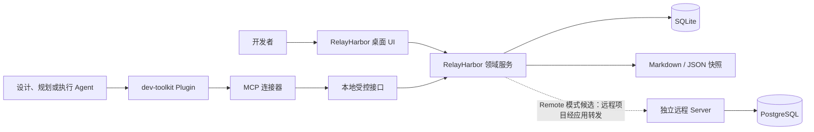

# RelayHarbor 项目概览

> 状态：已确认（2026-08-27 确认；同日定位修订：M1 为"Agent 经 MCP 写入 + UI 只读与导出"）
> 关联：OQ-001～OQ-006（已全部解决；OQ-002 含 2026-08-27 修订注）

## 文档目的

本文整理 RelayHarbor 的产品概念、首期边界和候选技术方向，作为后续需求分析与架构设计的起点。它不是已确认设计基线，也不表示当前 `agent-toolkits` 仓库已经包含桌面应用代码。

## 项目目标

RelayHarbor 是面向 AI 辅助开发流程的本地管理与追踪应用，目标是把需求、设计、任务及其关系放入一个可校验、可查询、可视化的管理平面。

它重点解决：

- 设计与任务散落在多个文档中，Agent 为定位单个条目需要加载过多上下文；
- 模型直接编辑文件时难以统一保证编号、状态、引用和并发一致性；
- 需求变更后，受影响的设计和任务缺少直观追踪；
- Markdown 适合审查，但不适合稳定承担复杂查询、状态迁移和关系图；
- 临时 MCP 进程退出后，可视化界面和本地管理能力随之消失。

## 当前已明确方向

- 工作名称使用 **RelayHarbor**，正式名称仍待确认。
- 产品形态为 Tauri 桌面应用，可在用户会话内以系统托盘方式持续运行。
- 应用同时承载本地领域服务、数据存储和可视化界面。
- `dev-toolkit` Plugin 通过轻量 MCP 连接器访问应用，模型不直接读写数据库。
- 模型能够按稳定编号读取条目，例如 `get_item("FR-001")`。
- UI 与 MCP 共用同一套领域规则、状态迁移和事务。
- 首期（M1）写入平面为 MCP：Agent 是唯一业务写入者，UI 只读并负责 Markdown 导出（2026-08-27 修订）；远程模式以独立 Server 为候选形态，多人协作为候选扩展。
- 数据库为唯一运行时事实来源，导出的 Markdown/JSON 仅为确定性快照（OQ-001 结论）。
- 首期仅交付设计与任务管理平面，执行 Agent 只读取任务和回写状态（OQ-002 结论）。UI 不承载管理写操作（2026-08-27 修订，详见范围）。
- 首发平台 Windows 优先，代码保持跨平台边界（OQ-005 结论）。

## 目标用户与利益相关者

- **开发者或技术负责人**：浏览设计基线、任务计划、依赖和变更影响，并导出 Markdown 文档集（M1 不在 UI 中做任何业务写操作）。
- **设计与规划 Agent**：M1 即通过 MCP 查询和维护需求、设计、基线及任务，是唯一业务写入者。
- **执行 Agent**：未来按已确认 `TASK-*` 获取上下文、更新执行状态和提交验证结果。
- **插件维护者**：维护 Skill、MCP 工具契约和桌面应用之间的兼容性。
- **团队管理员**：未来在远程模式下管理项目、成员、权限和共享数据。

## 成功标准

首版（M1）成功至少表现为：

- Agent 可以通过 MCP 完成项目、条目、状态、关系与任务的全部管理写入；
- 非法状态迁移、重复编号、悬空引用和任务依赖环会被拒绝；
- 已确认条目不能被物理删除，只能取消、废弃或替代；
- 用户可以通过只读界面浏览项目全部内容（条目、关联、看板、修订历史），并导出与 dev-toolkit 体系兼容的 Markdown 文档集；
- 关闭主窗口后应用仍可在系统托盘运行；
- 数据在会话结束后继续存在（M1 以数据库文件备份保障，确定性快照在 M2 交付）；
- 设计变化能够定位需要重新检查的设计条目和 `TASK-*`（基于关系展开）。

连接版（M2）追加：

- 基线确认流程与变更集预览界面可用；
- Markdown / JSON 确定性导入与快照可用，便于 Git 审查与恢复；
- 依赖与追踪关系图可视化可用。

## 范围

### 当前范围

范围裁剪为两批交付（2026-08-27 修订）。**首版（M1）为"Agent 写入 + 只读
UI"**：业务写入唯一入口是 MCP，桌面界面只读浏览并导出 Markdown。**连接版
（M2）紧随其后**：基线流程 UI、确定性导入与快照、关系图可视化。领域核心
与存储从第一版起保持完整，裁剪只发生在入口与外围功能。

首版（M1：MCP 写入平面 + 只读 UI）候选包含：

1. MCP 接入：本地受控 API（回环 + 令牌）、mcp-bridge 连接器、工具集与
   Plugin / 应用 / Schema 版本握手；
2. Agent 写入：项目创建与删除、条目创建与编辑（Markdown 正文）、合法
   状态迁移、关系维护、任务管理；
3. 稳定显示编号与内部 UUID，编号唯一性由领域规则保证；
4. 只读 UI：项目浏览与切换、条目详情（Markdown 渲染）、关联展开、任务
   看板（只读 + 阻塞标记）、关键词搜索、修订历史查看、影响定位；
5. Markdown 文档集导出（与 dev-toolkit 文档体系格式兼容）；
6. SQLite 本地存储、Schema 迁移、原子事务、乐观并发与不可变修订；
7. 单实例、系统托盘常驻与隐藏到托盘；
8. 基础应用设置（主题、关闭行为）。

连接版（M2：流程与交换）候选包含：

1. 基线确认流程与变更集预览界面；
2. Markdown / JSON 确定性导入与基线快照（M1 仅导出 Markdown，不导入）；
3. 依赖与追踪关系图可视化（首版以关联列表承载）。

### 不在首期范围

- 多用户实时协作、组织权限和云端账号体系；
- SQLite 与远程数据库之间的自动双向同步；
- 自动创建分支、Worktree、commit、PR 或 MR；
- 自动派发和持续监控实现 Subagent；
- GitLab、GitHub、Jira 等外部系统双向同步；
- Windows Service、macOS LaunchDaemon 或无用户会话的系统级服务；
- 移动端应用和独立浏览器 SaaS；
- 让 UI、Plugin 或 Agent 绕过领域服务直接访问数据库。

### 未来候选

- 独立远程 Server 与多人协作（认证、RBAC、PostgreSQL 存储），桌面端与 MCP 连接器以客户端形态接入；
- 任务执行编排、Worktree 隔离和线性历史集成；
- 外部 Issue、PR 和 CI 状态关联；
- 细粒度权限、审计导出和组织级项目管理；
- 跨项目需求、组件和任务关系；
- 通过 Plugin 自动安装或更新桌面连接器。

## 系统上下文

下图只表达系统级参与者和依赖，不展开内部模块设计：

RelayHarbor 领域服务是唯一业务入口和数据写入者。桌面 UI 使用 Tauri IPC 或应用内接口，MCP 连接器使用受保护的本地接口；两者不得各自实现状态规则。未来 Remote 模式下，独立 Server 成为同一领域核心的第二宿主；远程项目的读写由桌面应用转发到 Server，MCP 连接器始终只对接本地应用，领域规则仍然只有一份。

## 概念架构

### Tauri 桌面应用

- WebView 前端负责项目与条目浏览、任务看板（只读）、搜索、影响定位、导出和设置界面（关系图在 M2）；
- Rust Core 负责领域规则、事务、存储、后台生命周期和本地接口；
- 应用保持单实例，关闭窗口时默认隐藏到托盘，显式退出才终止；
- 托盘应用属于用户会话，不等同于操作系统服务。

### 领域服务

领域服务统一处理：

- 编号分配和唯一性；
- 条目创建、修订、取消、废弃和替代；
- 合法状态迁移；
- 关系维护和影响分析；
- 基线确认；
- 变更集预览、校验和原子提交；
- 乐观并发与审计信息。

UI、MCP 和未来 HTTP 客户端只调用领域服务，不直接包含这些规则。

### 存储

当前建议以 SQLite 作为本地默认存储，并从第一天定义存储适配接口。远程模式的候选形态是独立远程 Server：同一领域核心的第二宿主，承载认证、RBAC 与 PostgreSQL 存储；桌面应用对远程项目以 thin client 方式接入（数据归属按项目选择，本地与远程项目可并存），不直接访问远程数据库。

每个项目任一时刻只选择一个活动存储，不在首期实现本地与远程双写或离线同步。数据库是运行时事实来源；导出的 Markdown/JSON 是只读审查和恢复快照，不能与数据库双向编辑。

### MCP 接入

Plugin 随包提供 MCP 声明和轻量连接器，桌面应用独立安装与升级。连接器负责发现或后台启动 RelayHarbor，并把 MCP 调用转发到本地受控接口。连接器不区分本地与远程项目：远程项目的访问同样经本地应用转发，连接器不持有用户凭据。

MCP 接入自 M1 起交付（2026-08-27 修订，原排 M2）：Agent 是唯一业务写入者，`interfaces/http` 本地 API 与连接器随首版实现。

候选 MCP 能力：

- `get_project_state()`：读取项目、基线和阻塞状态；
- `get_item("FR-001")`：读取条目正文、状态、修订和关系；
- `search_items(...)`：按类型、状态、关键词和范围检索；
- `get_context(...)`：按深度和预算取得关联上下文；
- `preview_change_set(...)`：预演批量变化和校验结果；
- `apply_change_set(..., expected_revision)`：原子提交变更；
- `transition_item(...)`：执行合法状态迁移；
- `validate(...)`：检查编号、引用、覆盖和依赖。

不提供绕过状态规则的通用 SQL、任意文件访问或物理删除工具。

## 核心概念

- **Project**：隔离数据、编号空间和配置的项目。
- **Item**：具有内部 UUID、稳定显示编号、类型、状态和当前修订的管理对象。
- **Relation**：需求、用例、架构、任务等 Item 之间的有向语义关系。
- **Revision**：Item 的不可变历史版本。
- **Baseline**：用户明确确认的一组 Item 修订。
- **ChangeSet**：一次可预览、可校验并原子提交的变化集合。
- **Plan**：面向一个交付范围的任务计划、批次和集成顺序。
- **Task**：使用 `TASK-*` 标识的可执行工作单元。

显示编号继续沿用 `FR-*`、`NFR-*`、`BR-*`、`CON-*`、`UC-*`、`DOM-*`、`CMP-*`、`INT-*`、`SEQ-*`、`ADR-*`、`RISK-*`、`OQ-*` 和 `TASK-*`。编号一经进入确认基线不得复用。

## 安全与一致性原则

- 本地接口只绑定回环地址或使用本地 IPC；
- 连接器通过受限令牌和项目身份访问，不信任任意本地网页；
- 写操作携带期望修订号，冲突时拒绝覆盖；
- 多条相关修改使用单个 ChangeSet 事务；
- SQLite 只由 RelayHarbor 进程写入；
- Plugin、连接器、应用和数据库 Schema 进行版本握手；
- 数据库凭据和访问令牌不得随 Plugin 或项目文件分发；
- 生成快照必须具有固定顺序和格式，便于 Git 审查。

## 主要风险

- **数据库取代 Markdown 后降低原生 Git 可读性**：通过不可变修订和确定性快照缓解。
- **桌面应用与 Plugin 版本漂移**：通过能力协商和兼容版本检查缓解。
- **本地接口被其他进程滥用**：通过回环限制、随机端口、令牌、Origin 校验和最小工具权限缓解。
- **Tauri、Rust、前端和 MCP 多技术栈增加维护成本**：保持 MCP 连接器轻量，领域规则集中在 Rust Core。
- **过早支持远程协作扩大范围**：首期只实现 SQLite 和单用户模式。
- **业务写入唯一依赖 MCP 通道**：连接器或本地 API 故障时无法进行管理操作；以托盘常驻、bridge 自动拉起应用、错误日志与明确失败提示缓解。
- **领域模型过度结构化导致长篇设计难以表达**：允许 Item 同时包含结构化元数据和 Markdown 正文。

## 当前假设

- 首期优先满足单个开发者在本机管理一个或多个项目；
- RelayHarbor 桌面应用与 `dev-toolkit` Plugin 分别发布；
- MCP 连接器不保存业务数据，只转发请求；
- SQLite 是首期唯一实现的存储提供者（OQ-003 已确认，保留存储端口）；
- 首发操作系统为 Windows 优先（OQ-005 已确认）；UI 技术栈候选定为 React + TypeScript + Fluent UI v9，记录于仓库根《project structure.md》，待 04 架构阶段转正为 ADR。

## 开放问题入口

全部开放问题已解决，结论见 [开放问题](../open-questions.md)。其中 OQ-001（数据库为唯一事实来源）与 OQ-002（首期仅管理平面）是后续需求分析与架构设计的直接前提。
