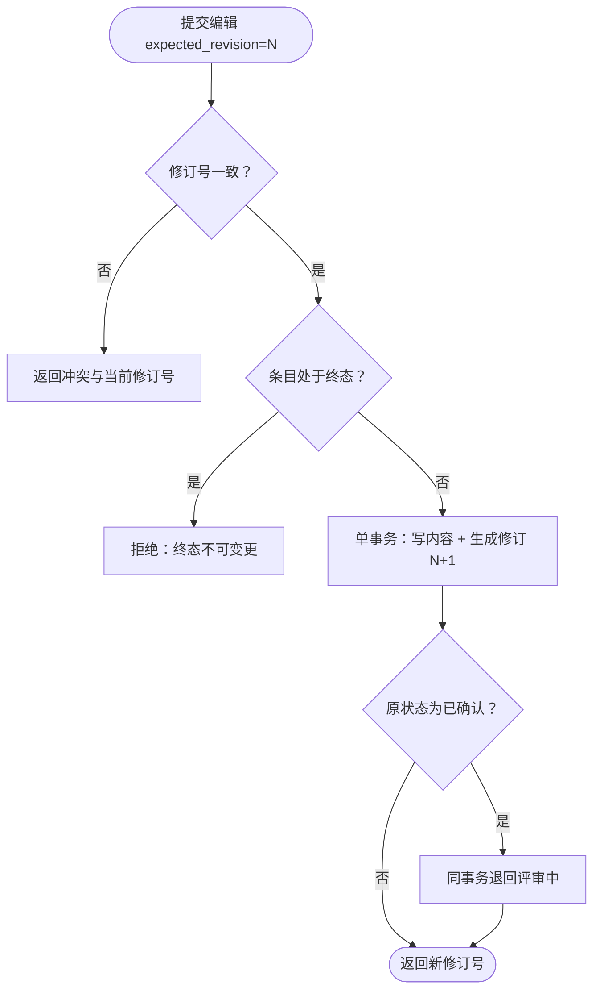

# UC-004 编辑条目产生修订

> 状态：草稿
> 关联：FR-003、BR-001、BR-004、BR-005、BR-009、NFR-001、NFR-009

## 目标

Agent 修改条目内容，系统生成不可变修订并保持编号稳定；对已确认条目按
BR-009 处理状态。

## 参与者

- 主要参与者：ACT-002 设计与规划 Agent
- 支持参与者：无

## 触发

Agent 调用条目编辑工具（或 ChangeSet 中包含条目内容变更），携带条目标识、
期望修订号 `expected_revision` 与新内容（标题 / 元数据 / Markdown 正文）。

## 前置条件

- UC-009 已完成，MCP 会话与令牌有效；
- 项目与目标条目存在。

## 最小保证

- 失败时条目保持调用前的修订与状态，库内无部分变更（NFR-009）；
- 拒绝原因明确返回给调用方；
- 既有修订记录不受任何影响（BR-004）。

## 成功保证

- 生成新修订（修订号 +1、时间、变更者 = Agent 会话标识、完整内容快照）；
- 条目显示编号不变（BR-001）；
- 若条目原状态为已确认，状态回到评审中并体现在修订记录中（BR-009 拟定）；
- 调用方获得新修订号。

## 主流程

1. Agent 以稳定编号或 UUID 读取条目，获得当前内容与修订号 N；
2. Agent 提交编辑，携带 `expected_revision = N` 与新内容；
3. 系统校验会话令牌与项目归属；
4. 系统校验条目当前修订号仍为 N（BR-005）；
5. 系统在单个事务内写入新内容并生成修订 N+1；
6. 若条目原状态为已确认，同一事务内将状态迁移为评审中（BR-009）；
7. 系统返回新修订号与（如触发）新状态。

## 备选流程

### A1 期望修订号不一致

第 4 步发现当前修订号 ≠ N：拒绝写入，返回当前修订号与冲突说明；调用方
重新读取内容后自行决定重试。系统不自动合并（BR-005）。

### A2 条目处于终态

条目状态为已取消或已替代：拒绝编辑，返回终态不可变更的原因；替代场景应
编辑替代者条目。

### A3 内容为空或类型非法

新内容未通过结构校验（如正文为空、类型不属于 14 种前缀）：拒绝并返回
校验错误，事务不开始。

## 异常流程

### E1 写入中途失败

事务内任一步失败（磁盘错误、进程中断）：整个事务回滚，数据保持调用前
状态，返回明确错误；重启后库处于一致状态（NFR-001）。

## 业务规则

- BR-001：编号不变、不复用；
- BR-004：修订不可变、变更者记录；
- BR-005：乐观并发，冲突拒绝；
- BR-009：已确认条目编辑后退回评审中（拟定，见开放问题）。

## 非功能要求

- NFR-001：提交返回的数据零丢失；
- NFR-009：原子提交或明确失败，无半写状态。

## 流程图（可选）

## 开放问题

- BR-009 最终语义已定稿：采用"退回评审中"（2026-08-27 确认）。
- 纯元数据修改不触发退回、条目类型创建后不可变：已在 03 领域模型定稿
  （DOM-002、INV-008、状态模型转换规则）。
