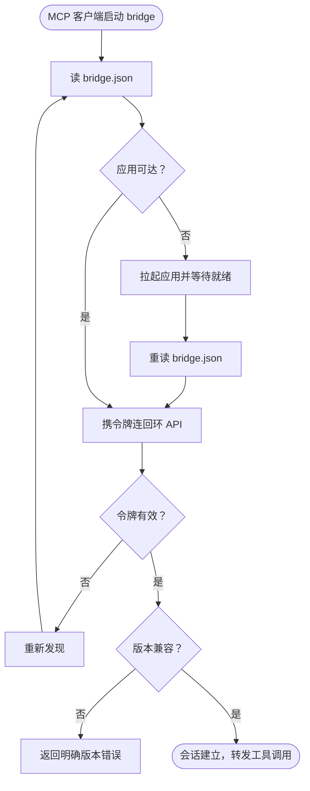

# UC-009 建立 MCP 会话

> 状态：草稿
> 关联：FR-001、NFR-005、CON-003、CON-007

## 目标

Agent 的 MCP 客户端经 mcp-bridge 与应用建立经过鉴权与版本握手的工具通道，
成为唯一业务写入入口。

## 参与者

- 主要参与者：ACT-002 设计与规划 Agent（以 MCP 客户端形态）
- 支持参与者：ACT-003 系统环境（bridge.json 文件、回环网络、进程拉起）

## 触发

MCP 客户端按 stdio 方式启动 mcp-bridge（通常由 dev-toolkit Plugin 配置）。

## 前置条件

- RelayHarbor 桌面应用已安装；
- 本机用户目录可写（`~/.relayharbor/runtime/`）。

## 最小保证

- 未通过令牌校验前，不向调用方暴露任何工具；
- 鉴权与握手失败不影响库内业务数据；
- 失败原因明确返回给 MCP 客户端，不静默挂起。

## 成功保证

- bridge 与应用之间建立回环 HTTP 通道，会话令牌有效；
- 版本握手通过（Plugin / 应用 / 数据库 Schema）；
- 工具调用可在该会话上执行，调用记录进入日志（NFR-007）。

## 主流程

1. bridge 读取 `~/.relayharbor/runtime/bridge.json`（端口 + 会话令牌 + 协议版本）；
2. bridge 以 HTTP 连接回环地址上的本地 API，携带令牌；
3. 应用校验令牌；
4. 双方执行版本握手（协议版本、Schema 版本兼容性）；
5. 会话建立，bridge 在 MCP 客户端（stdio）与应用（HTTP）之间转发工具调用。

## 备选流程

### A1 bridge.json 缺失或应用未运行

bridge 尝试拉起应用并等待就绪（超时上限见 05 详细设计），随后重新读取
bridge.json 并继续主流程。

### A2 令牌无效或过期

应用重启后会话令牌轮换，旧令牌失效：bridge 重新执行发现流程（读
bridge.json → 必要时拉起 → 重连）。

### A3 版本不兼容

握手发现 Plugin / 应用 / Schema 版本不兼容：返回明确错误（哪一方、哪个
版本、需要的最低版本），工具调用不被执行（NFR-006）。

## 异常流程

### E1 应用崩溃或退出

通道中断：bridge 向 MCP 客户端返回连接错误；下次调用时重新走 A1 发现与
拉起流程。库内已提交数据不受影响（NFR-001）。

### E2 端口被占用

应用启动时默认端口不可用：改用随机端口并更新 bridge.json；对外仍表现为
bridge.json 指向的当前端口。

## 业务规则

- 无直接业务规则；本用例是所有 Agent 写入用例（UC-001～008）的通道前提。

## 非功能要求

- NFR-005：仅回环监听、会话令牌轮换、bridge.json 用户级权限；
- NFR-003：bridge 拉起应用的就绪时限；
- NFR-007：工具调用记录入日志。

## 流程图（可选）

## 开放问题

- bridge 拉起应用的等待上限与重试策略已在 05 详细设计定案：500ms 轮询、
  上限 15 秒（modules/bridge.md、SEQ-002）；实现语言随 Plugin 联定，
  不影响契约。
