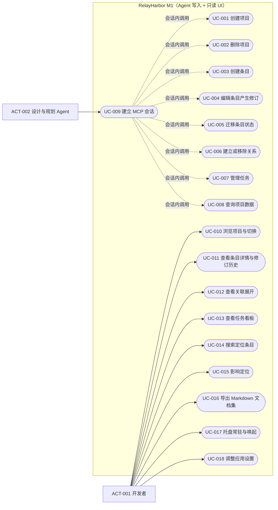

# 用例目录

> 状态：草稿

## Agent 写入与查询（经 MCP）

### UC-001 创建项目

- 状态：草稿
- 主要参与者：ACT-002
- 目标：为一个新的工作流建立隔离的项目空间
- 触发：Agent 调用项目管理工具，提供名称与可选仓库路径
- 优先级：必须
- 关联需求：FR-002
- 详细规约：无需独立规约（BR-011 之外为简单创建；编号空间初始化由 BR-001 承载）

### UC-002 删除项目

- 状态：草稿
- 主要参与者：ACT-002
- 目标：移除项目及其全部数据
- 触发：Agent 调用项目删除工具并携带显式确认参数
- 优先级：必须
- 关联需求：FR-002、BR-011
- 详细规约：无需独立规约（级联事务由 BR-011 完整约束）

### UC-003 创建条目

- 状态：草稿
- 主要参与者：ACT-002
- 目标：新增一个设计资产管理对象并获得稳定编号
- 触发：Agent 调用条目创建工具（类型、标题、元数据、Markdown 正文）
- 优先级：必须
- 关联需求：FR-003、FR-004、BR-001
- 详细规约：无需独立规约（编号与修订规则已由 BR-001/BR-004 完整约束）

### UC-004 编辑条目产生修订

- 状态：草稿
- 主要参与者：ACT-002
- 目标：修改条目内容并留下不可变修订
- 触发：Agent 调用编辑工具，携带期望修订号与新内容
- 优先级：必须
- 关联需求：FR-003、BR-004、BR-005、BR-009
- 详细规约：[查看](cases/uc-004-edit-item.md)

### UC-005 迁移条目状态

- 状态：草稿
- 主要参与者：ACT-002
- 目标：推进条目生命周期（评审、确认、取消、替代）
- 触发：Agent 调用状态迁移工具
- 优先级：必须
- 关联需求：FR-005、BR-002、BR-008
- 详细规约：[查看](cases/uc-005-transition-item.md)

### UC-006 建立或移除关系

- 状态：草稿
- 主要参与者：ACT-002
- 目标：在两个条目间维护有向语义关系
- 触发：Agent 调用关系工具（建立/移除，类型限定五种）
- 优先级：必须
- 关联需求：FR-006、BR-006、BR-007
- 详细规约：[查看](cases/uc-006-manage-relation.md)

### UC-007 管理任务

- 状态：草稿
- 主要参与者：ACT-002
- 目标：创建任务并推进任务状态（复用条目与关系机制）
- 触发：Agent 调用任务创建 / 任务状态迁移 / 任务依赖工具
- 优先级：必须
- 关联需求：FR-007、BR-002、BR-010
- 详细规约：无需独立规约（任务即条目：创建与编辑同 UC-003/UC-004，状态白名单与阻塞派生由 BR-002/BR-010 承载）

### UC-008 查询项目数据

- 状态：草稿
- 主要参与者：ACT-002
- 目标：按稳定编号或条件取得条目及其上下文，供 Agent 消费
- 触发：Agent 调用读取类工具（get_item / search_items / get_context 等）
- 优先级：必须
- 关联需求：FR-001
- 详细规约：无需独立规约（纯读取，行为由工具契约与 NFR-002 承载）

### UC-009 建立 MCP 会话

- 状态：草稿
- 主要参与者：ACT-002
- 目标：经 bridge 与应用建立经过鉴权与版本握手的工具通道
- 触发：MCP 客户端启动 mcp-bridge（stdio）
- 优先级：必须
- 关联需求：FR-001、NFR-005
- 详细规约：[查看](cases/uc-009-mcp-session.md)

## 开发者浏览与导出（只读 UI）

### UC-010 浏览项目与切换

- 状态：草稿
- 主要参与者：ACT-001
- 目标：选择要查看的项目
- 触发：开发者打开应用或从项目内返回列表
- 优先级：必须
- 关联需求：FR-008、FR-018（进入后默认概览，2026-08-28 补）
- 详细规约：无需独立规约

### UC-011 查看条目详情与修订历史

- 状态：草稿
- 主要参与者：ACT-001
- 目标：阅读条目当前内容与历史版本
- 触发：开发者从列表、搜索结果或关联跳转进入条目
- 优先级：必须
- 关联需求：FR-009、BR-004
- 详细规约：无需独立规约

### UC-012 查看关联展开

- 状态：草稿
- 主要参与者：ACT-001
- 目标：阅读单个条目的一层关联上下文
- 触发：开发者在条目详情查看关联区
- 优先级：必须
- 关联需求：FR-010
- 详细规约：无需独立规约

### UC-013 查看任务看板

- 状态：草稿
- 主要参与者：ACT-001
- 目标：纵览任务状态与阻塞来源
- 触发：开发者进入项目看板视图
- 优先级：必须
- 关联需求：FR-011、BR-010
- 详细规约：无需独立规约（只读展示，无迁移入口）

### UC-014 搜索定位条目

- 状态：草稿
- 主要参与者：ACT-001
- 目标：按关键词快速定位条目
- 触发：开发者使用搜索
- 优先级：应该
- 关联需求：FR-012
- 详细规约：无需独立规约

### UC-015 影响定位

- 状态：草稿
- 主要参与者：ACT-001
- 目标：获得某条目变更后需重新检查的条目与任务清单
- 触发：开发者在条目上选择"影响定位"
- 优先级：必须
- 关联需求：FR-013
- 详细规约：[查看](cases/uc-015-impact-analysis.md)

### UC-016 导出 Markdown 文档集

- 状态：草稿
- 主要参与者：ACT-001
- 目标：获得可归档、可审查的项目文档快照
- 触发：开发者选择项目执行"导出"
- 优先级：必须
- 关联需求：FR-014
- 详细规约：[查看](cases/uc-016-export-markdown.md)

### UC-017 托盘常驻与唤起

- 状态：草稿
- 主要参与者：ACT-001
- 目标：应用常驻后台、随时唤回，数据不丢
- 触发：关闭主窗口 / 从托盘菜单显示 / 二次启动
- 优先级：必须
- 关联需求：FR-015、FR-017（启动恢复位置，2026-08-28 补）、CON-006
- 详细规约：无需独立规约

### UC-018 调整应用设置

- 状态：草稿
- 主要参与者：ACT-001
- 目标：调整主题、界面语言与关闭行为（2026-08-28 界面设计修订，UI-004）
- 触发：开发者打开设置界面
- 优先级：应该
- 关联需求：FR-016
- 详细规约：无需独立规约

## 用例图

