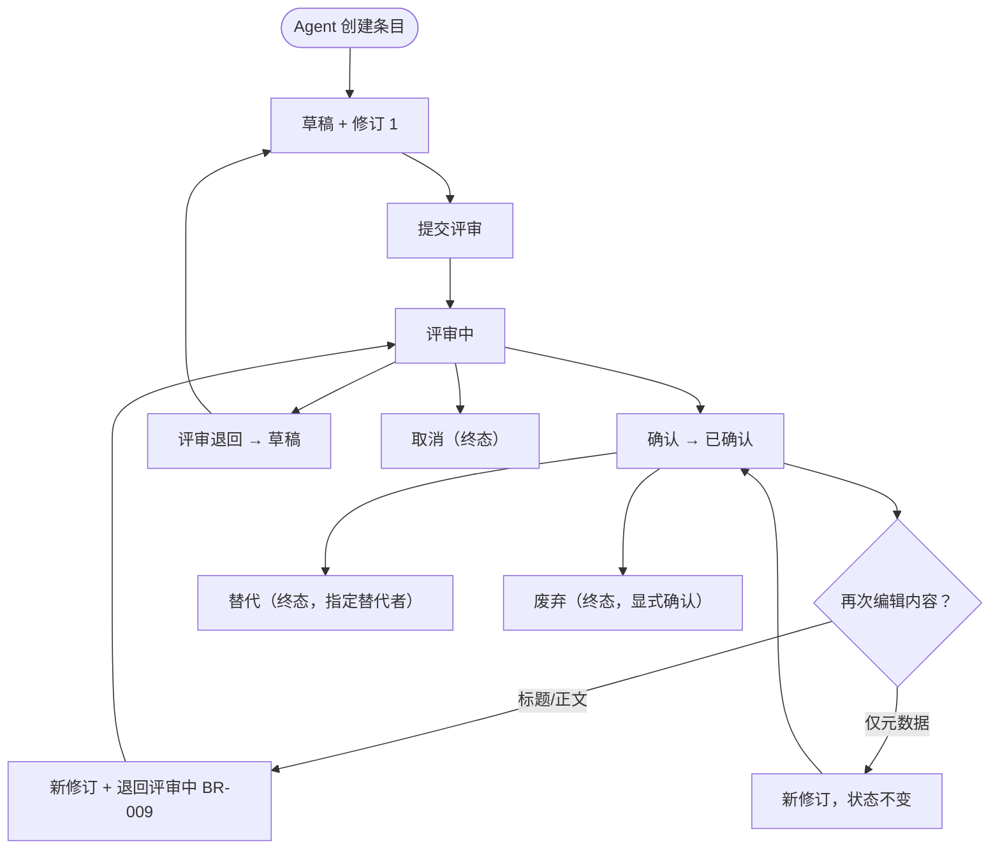
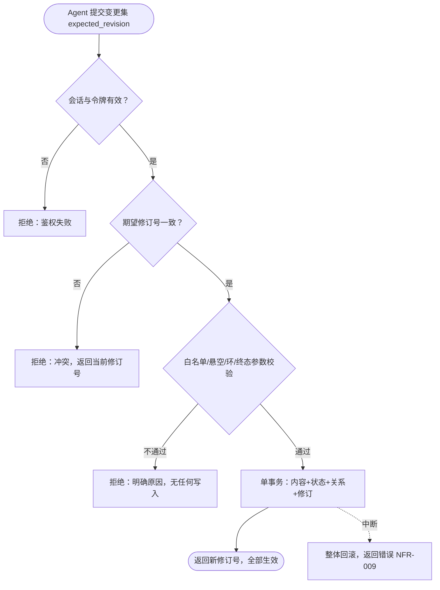

# 业务过程

> 状态：草稿
> 关联：UC-004、UC-005、UC-006、DOM-002、DOM-004、DOM-005

只描述跨多个对象或角色的过程，不把每个用例重复成过程图。

## 过程一：条目内容演进与确认循环

### 触发与参与方

- 触发：Agent 在设计工作流中创建、修改条目，或对已确认条目再次修改；
- 参与方：设计与规划 Agent（经 MCP 执行全部写操作）；开发者（在只读 UI
  审阅内容与修订，间接触发 Agent 的修改意图）；
- 责任分界：Agent 负责起草与推进状态；开发者负责阅读、审阅与提出修改
  意图（M1 不在 UI 操作）。

### 流程图

### 关键说明

- 决策依据：修改的是"内容"（标题/正文）还是"元数据"决定是否触发退回
  （2026-08-27 访谈确认）；条目类型不可变（INV-008）；
- 不可逆节点：进入已取消 / 已替代 / 已废弃后不可再变更，只能另建条目；
- 每次变更都产生不可变修订，审阅轨迹完整（BR-004）；
- TASK 条目不参与此循环（无已确认态，见状态模型）。

## 过程二：变更集原子提交

### 触发与参与方

- 触发：Agent 调用任一写入工具（编辑、状态迁移、关系增删）；
- 参与方：Agent（组装与提交）；领域服务（校验与事务）；开发者无参与
  （M2 增加预览 UI 后加入人工审阅）。

### 流程图

### 关键说明

- 决策依据：全部校验先于写入，任一失败即整体拒绝（BR-002/005/006/007/008）；
- 不可逆节点：事务提交成功即对后续所有读取可见，不可静默撤回（只能以
  新变更集补偿）；
- 补偿路径：无自动补偿；调用方依拒绝原因修正后重新提交；
- 此过程是 M1 全部写入（UC-004/005/006/007）的公共路径，NFR-009 的承载点。
