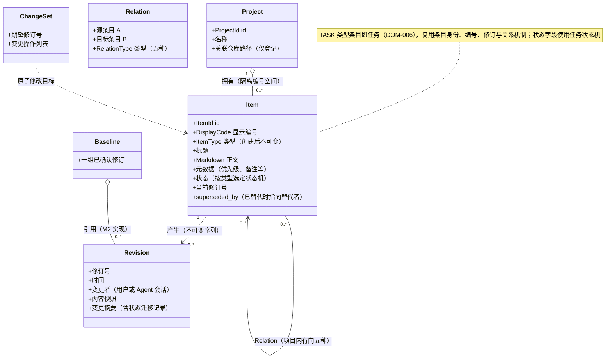

# 领域模型

> 状态：草稿
> 关联：FR-001～016、BR-001～011、UC-001～018

## 概念总览

## 概念条目

### DOM-001 项目

- 定义：隔离数据、编号空间与配置的工作空间；M1 由 Agent 经 MCP 创建与删除
- 身份：ProjectId（内部 UUID）；名称仅为展示属性
- 关键属性：名称、关联仓库路径（仅登记，不识别内容）
- 生命周期：创建即注册于项目注册表；删除为级联事务，连同全部条目、关系、修订与编号空间一并移除
- 负责规则：BR-001（编号空间隔离）、BR-011（级联删除）
- 关系：拥有条目；关系不得跨项目
- 来源：UC-001、UC-002、UC-010
- 假设与开放问题：项目名称不要求唯一（2026-08-27 确认，UUID 为身份，名称仅展示）

### DOM-002 条目

- 定义：具有稳定显示编号、类型、状态与修订历史的管理对象；M1 的需求、设计、任务等设计资产统一为条目
- 身份：ItemId（内部 UUID）；对外以 DisplayCode（DOM-008）引用
- 关键属性：类型（14 种前缀之一，创建后不可变——编号前缀与类型绑定）、标题、Markdown 正文、结构化元数据（优先级、备注等辅助信息）、状态、当前修订号、superseded_by
- 生命周期：非 TASK 条目走条目状态机（草稿 → 评审中 → 已确认，终态已取消/已替代/已废弃）；TASK 条目走任务状态机（DOM-006）；M1 无条目级物理删除——作废只能取消、废弃或替代（BR-003 及"暂无删除入口"的现状）
- 负责规则：BR-002、BR-003、BR-004、BR-005、BR-008、BR-009
- 关系：产生修订；与同项目条目建立关系；被变更集原子修改
- 来源：UC-003、UC-004、UC-005、UC-011
- 修订留痕：2026-09-01 用户指令——UI-xxx 界面设计规格升格为第 14 条目类型
  （UI），编号沿用既有 UI-xxx 体系（索引见 05-detailed-design/ui/README.md，
  已被代码注释广泛引用）；类型固定序插入 SEQ 之后、ADR 之前。
  条目模型外长文档的纳入方式暂缓（2026-09-02 用户指令回退浏览页，
  重议中，见 open-questions.md OQ-007）
- 假设与开放问题：无

### DOM-003 关系

- 定义：同一项目内两个条目之间的有向语义链接；统一读作 **"A 对 B 做某事"（动者在前）**，A 是动作发出方（多为下游/果），B 是承受方（多为上游/因）
- 身份：（源条目，目标条目，类型）三元组；同向同类唯一，重复建立幂等合并
- 关键属性：五种类型——
  - `A derives B`：A 派生自 B（B 是 A 的来源，如设计条目派生自需求条目）；
  - `A depends B`：A 依赖 B（B 未完成则 A 阻塞；主要用于任务间）；
  - `A satisfies B`：A 满足 B（A 是 B 的落实，如任务满足需求）；
  - `A traces B`：A 追踪到 B（松散溯源，如条目追踪到某决策）；
  - `A relates B`：A 关联 B（无特定因果语义）。
- 生命周期：建立时校验悬空（BR-006）与 depends 环（BR-007）；可移除；随条目所在项目级联删除
- 负责规则：BR-006、BR-007
- 关系：两端必须为同项目的已存在条目
- 来源：UC-006、UC-012
- 影响定位语义：从目标条目 T 出发，沿 derives / satisfies / depends 的**入边**做反向多跳闭包（"谁派生自我、谁满足我、谁依赖我"），命中者即受影响；traces 与 relates 不参与影响遍历，仅作上下文展示

### DOM-004 修订

- 定义：条目内容或状态在某一时刻的不可变快照；条目当前内容恒等于最新修订
- 身份：（条目，修订号），修订号单调递增
- 关键属性：修订号、时间、修订标题、内容快照、变更摘要（含状态迁移前后）；操作者不入修订（2026-09-03 用户指令，审计由操作日志承载）
- 生命周期：随每次编辑或状态迁移追加；不可修改、不可删除
- 负责规则：BR-004、BR-005（期望修订号即乐观并发凭据）
- 关系：属于唯一条目；乐观并发以"期望修订号 = 当前修订号"为写入前提
- 来源：UC-004、UC-011
- 假设与开放问题：无

### DOM-005 变更集

- 定义：一次可整体校验、原子提交的变更单位；多步修改要么全部生效，要么全部不生效
- 身份：提交时生成的事务标识
- 关键属性：期望修订号（按目标条目）、变更操作列表（内容编辑 / 状态迁移 / 关系增删）
- 生命周期：M1 为直接原子提交；M2 增加预览与基线确认流程（UI）
- 负责规则：BR-005、NFR-009
- 关系：以条目为修改目标
- 来源：UC-004、UC-005、UC-006
- 假设与开放问题：变更集跨多项目的语义（当前假设：单变更集限单项目）

### DOM-006 任务

- 定义：类型为 TASK 的条目，即可执行工作单元；不是独立实体，复用条目的身份、编号、修订与关系机制
- 身份：同条目（ItemId / `TASK-*` 编号）
- 关键属性：状态字段使用任务状态机（待办 / 进行中 / 待验收 / 完成 / 已取消），不使用条目三态；阻塞为由未完成 depends 上游派生的只读属性（BR-010）
- 生命周期：待办 → 进行中 → 待验收 → 完成（含退回与取消，见状态模型）
- 负责规则：BR-002、BR-007、BR-010
- 关系：经 depends 形成任务间依赖；经 satisfies 关联被满足的需求或设计
- 来源：UC-007、UC-013
- 假设与开放问题：任务内容编辑不触发"退回评审中"（任务无已确认态，BR-009 不适用）

### DOM-007 基线

- 定义：用户明确确认的一组条目修订集合；M2 交付确认流程与 UI，M1 仅保留概念占位
- 身份：BaselineId
- 关键属性：引用的修订集合、确认时间、确认者
- 生命周期：M2 定义
- 负责规则：无（M2 补充）
- 关系：引用修订；不改变修订不可变性
- 来源：00 概览核心概念
- 假设与开放问题：M2 进入范围时展开建模

### DOM-008 稳定编号

- 定义：条目对外的显示标识，格式"前缀-序号"（如 FR-001）；前缀由条目类型决定，序号按类型在项目内独立递增
- 身份：项目内唯一；即值对象，两编号相同即指向同一条目
- 关键属性：前缀（14 种之一，与类型一一绑定）、序号
- 生命周期：创建时由领域规则分配；永不复用（条目取消、替代或项目内其他变迁后，该编号仍属原条目）；项目删除后编号空间整体废弃
- 负责规则：BR-001、FR-004
- 关系：MCP 工具与 UI 均以编号为主要引用方式
- 来源：UC-003、UC-008
- 假设与开放问题：无

### 未建模的概览概念（Plan）

00 概览核心概念中的 **Plan**（面向交付范围的任务计划、批次与集成顺序）
在 M1/M2 需求中无承载（任务管理由 TASK 条目 + depends 关系承担），故
不建模、不分配 DOM 编号；进入范围时按修订循环回到 01 需求补条目后再
建模（06 验证 FINDING-002 的处理）。

## 不变量与所有权说明

图无法完整表达的规则，编号便于跨文档引用：

- **INV-001**：项目内显示编号唯一且永不复用（BR-001）；
- **INV-002**：depends 关系有向无环，其余类型不参与环约束（BR-007）；
- **INV-003**：关系两端条目存在且属于同一项目；跨项目关系为未来候选（BR-006）；
- **INV-004**：修订只增不改；条目当前内容 = 最新修订（BR-004）；
- **INV-005**：状态迁移仅允许所属类型状态机的白名单路径（BR-002）；
- **INV-006**：处于"已替代"的条目 superseded_by 必填且指向同项目存在的条目；替代者自身不得处于终态（BR-008）；
- **INV-007**：任务阻塞是派生只读属性，不落库为状态（BR-010）；
- **INV-008**：条目类型创建后不可变（编号前缀与类型绑定，2026-08-27 访谈确认）；
- **INV-009**：变更集原子生效或整体失败，无半写状态（NFR-009）；
- **INV-010**：项目删除级联移除项目内全部条目、关系、修订与编号空间（BR-011）。

所有权边界：

- **项目是聚合根**：编号空间、级联删除以项目为界；条目、关系、修订均归属项目；
- **条目是一致性单元**：编辑、状态迁移、乐观并发均以条目（当前修订号）为并发控制粒度；
- **关系独立校验**：建立时跨条目校验（存在性、环），但不变量由领域服务在提交事务内保证，不归属单一条目；
- **写入入口唯一**：一切业务变更经变更集原子提交（M1 经 MCP 工具触发）；UI 只读。
