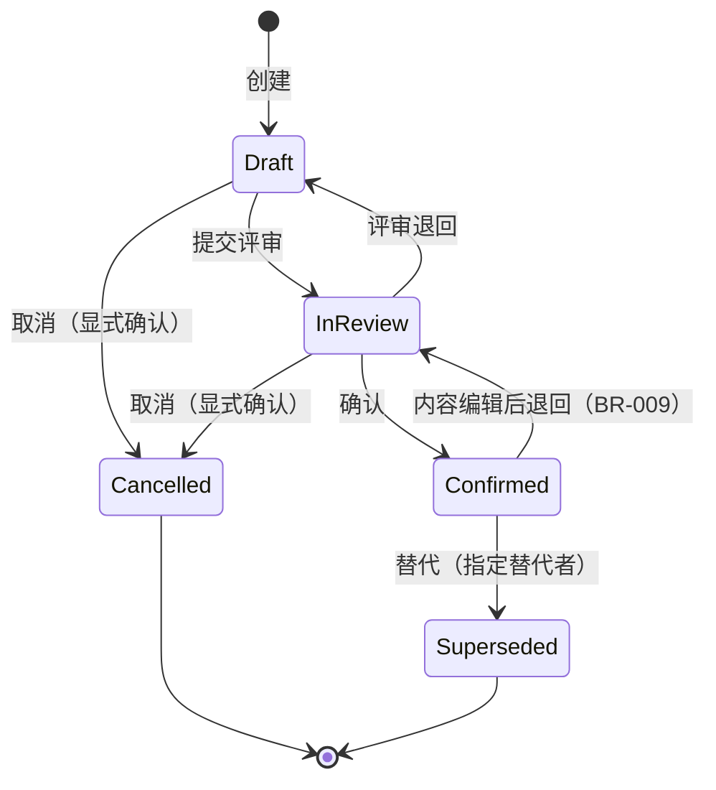
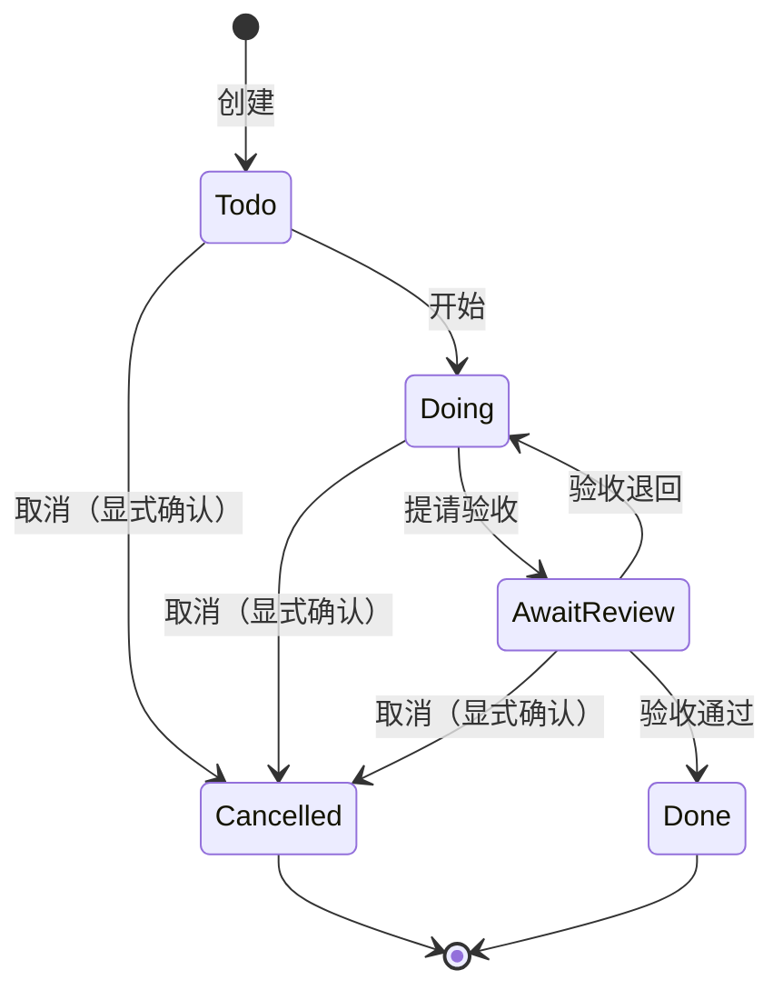

# 状态模型

> 状态：草稿
> 关联：DOM-002、DOM-006、BR-002、BR-003、BR-008、BR-009

条目只有一个状态字段，按类型选定状态机：非 TASK 条目使用条目状态机，
TASK 条目使用任务状态机。两个状态机互不混用（INV-005）。

## DOM-002 条目（非 TASK）的状态生命周期

### 状态图

### 转换规则

| 转换 | 业务条件 | 执行角色 | 事件或副作用 | 并发与非法转换处理 |
| --- | --- | --- | --- | --- |
| 创建 → 草稿 | 类型合法（13 种前缀之一），分配编号 | Agent（MCP） | 生成修订 1 | 编号冲突由领域分配杜绝；重复创建请求生成两个条目（幂等性由调用方保证） |
| 草稿 → 评审中 | 无附加条件 | Agent（MCP） | 追加修订（记录迁移） | 携带期望修订号；不一致拒绝（BR-005） |
| 评审中 → 已确认 | 无附加条件 | Agent（MCP） | 追加修订（记录迁移） | 同上 |
| 评审中 → 草稿 | 退回评审 | Agent（MCP） | 追加修订（标注"评审退回"） | 同上 |
| 草稿/评审中 → 已取消 | 调用显式携带确认参数 | Agent（MCP） | 追加修订；条目保持可查询 | 缺确认参数拒绝；终态不可再迁移 |
| 已确认 → 已替代 | 指定替代者：存在、同项目、非自身、非终态（INV-006） | Agent（MCP） | 追加修订；superseded_by 落库；详情展示替代者 | 替代者无效拒绝；已替代不可再迁移 |
| 已确认 → 评审中 | 标题或正文被修改（仅内容触发，元数据修改不触发） | Agent（MCP） | 同一事务内：新修订 + 状态退回 | 期望修订号冲突拒绝（BR-005/BR-009） |
| 已取消/已替代 → 任意 | 终态，禁止一切迁移与内容编辑 | — | — | 拒绝并返回终态原因（UC-004 A2） |

备注：

- M1 无条目物理删除；"已确认不可物理删除"（BR-003）在 M1 表现为全类型
  无删除入口，规则保留以约束未来入口；
- 状态迁移均为修订记录的一部分，满足 BR-004。

## DOM-006 任务（TASK 条目）的状态生命周期

### 状态图

### 转换规则

| 转换 | 业务条件 | 执行角色 | 事件或副作用 | 并发与非法转换处理 |
| --- | --- | --- | --- | --- |
| 创建 → 待办 | TASK 类型，分配 `TASK-*` 编号 | Agent（MCP） | 生成修订 1 | 同条目规则 |
| 待办 → 进行中 | 无附加条件 | Agent（MCP） | 追加修订 | 期望修订号冲突拒绝 |
| 进行中 → 待验收 | 无附加条件 | Agent（MCP） | 追加修订 | 同上 |
| 待验收 → 完成 | 无附加条件（人工验收在 UI 只读审阅后由 Agent 执行） | Agent（MCP） | 追加修订；下游阻塞标记自动解除 | 同上 |
| 待验收 → 进行中 | 验收退回 | Agent（MCP） | 追加修订（标注退回） | 同上 |
| 待办/进行中/待验收 → 已取消 | 调用显式携带确认参数 | Agent（MCP） | 追加修订 | 缺确认参数拒绝；终态不可迁移 |
| 完成/已取消 → 任意 | 终态，禁止迁移 | — | — | 拒绝 |

备注：

- 任务无"已确认"态：内容编辑不触发状态退回，只产生修订（BR-009 不适用
  于 TASK）；
- 阻塞不是状态：由未完成 depends 上游派生（BR-010、INV-007），上游完成
  即自动解除，无迁移发生。
