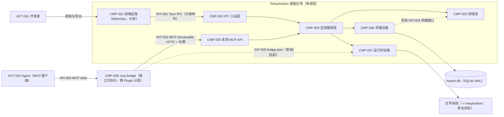

# 组件与总览

> 状态：草稿
> 关联：UC-001～018、NFR-001～009、ADR-001～008

## 架构总览图

图后说明：

- **责任**：见下方组件条目；两入站层（ipc/http）各自定义 DTO，共用
  services 与 domain，规则只有一份；
- **数据所有权**：业务数据唯一权威在 harbor.db，仅 CMP-006 写入；导出物
  与 bridge.json 是派生文件；
- **信任边界**：http 是唯一对外暴露面（回环 + 令牌，ADR-004/005）；ipc
  为进程内受信（ADR-006）；数据库无第二写入者（CON-003）；
- **故障边界**：bridge 崩溃只影响 Agent 通道（可重连，UC-009 E1）；应用
  崩溃影响全部入口（WAL 保证库一致，NFR-001）；WebView 崩溃仅 UI；
- **省略**：migrations、日志细节、Tauri 插件（单实例/托盘）归 CMP-007。

## 组件条目

### CMP-001 前端应用（WebView）

- 状态：已确认
- 责任：只读 UI——项目浏览、条目详情（Markdown 渲染）、关联展开、任务
  看板（只读）、搜索、影响定位、导出触发、设置界面
- 不负责：任何业务写操作（CON-009）；数据获取协议细节（invoke 只在 `api/`）
- 拥有的数据：无（服务端状态只存 TanStack Query 缓存；Zustand 仅 UI 态）
- 提供接口：无（消费 INT-001）
- 依赖：CMP-002（经 `api/` 层）
- 承载用例：UC-010～018
- 响应的质量属性：NFR-008、NFR-002
- 失败影响：UI 不可用；Agent 写入通道不受影响
- 部署单元：应用进程内 WebView2

### CMP-002 IPC 入站层（interfaces/ipc）

- 状态：已确认
- 责任：Tauri 命令面（查询 / 导出 / 应用设置三类，无业务写命令）；DTO
  定义与 specta 类型导出；承载 `data-changed` 事件向 WebView 的广播通道
  （事件由写入口发射，见 CMP-003；ipc 层只提供广播基础设施）
- 不负责：业务规则；MCP 协议
- 拥有的数据：无
- 提供接口：INT-001
- 依赖：CMP-004
- 承载用例：UC-010～018
- 响应的质量属性：CON-009（白名单 lint 可校验）
- 失败影响：UI 取数失败
- 部署单元：应用进程

### CMP-003 本地 MCP API（interfaces/http）

- 状态：已确认
- 责任：MCP Streamable HTTP 端点（axum）；令牌鉴权、回环绑定、会话
  管理、版本握手；MCP 工具 → services 映射；写工具提交成功后发射
  `data-changed` 变更事件（失效信号，供 UI 刷新，ADR-006）
- 不负责：业务规则；UI 请求
- 拥有的数据：会话状态（令牌、协议版本）
- 提供接口：INT-002
- 依赖：CMP-004、CMP-007（bridge.json 读取与令牌轮换）
- 承载用例：UC-001～009
- 响应的质量属性：NFR-005、NFR-009
- 失败影响：Agent 写入通道中断（bridge 可重连/拉起）
- 部署单元：应用进程

### CMP-004 应用服务层（services）

- 状态：已确认
- 责任：用例编排——项目/条目/关系/任务操作、变更集组装与提交、查询、
  影响分析、导出编排；操作签名带 CallContext/actor（远程预留）
- 不负责：不变量与状态机判定（属 CMP-005）
- 拥有的数据：无（无状态）
- 提供接口：被 CMP-002/003 调用（进程内）
- 依赖：CMP-005、CMP-006（经端口）、CMP-007（导出写盘）
- 承载用例：全部
- 响应的质量属性：NFR-009（原子提交路径）
- 失败影响：全部业务操作失败
- 部署单元：应用进程

### CMP-005 领域层（domain）

- 状态：已确认
- 责任：不变量与规则唯一归属（INV-001～010）、双状态机、编号分配、环
  检测、修订语义、端口定义（ports.rs）
- 不负责：IO、事务实现、路径、协议
- 拥有的数据：无（纯逻辑）
- 提供接口：INT-004（端口定义方）
- 依赖：无（零框架依赖，ADR-001）
- 承载用例：为全部写入用例提供规则判定
- 响应的质量属性：NFR-009、可测试性（`src-tauri/tests/` 的锚）
- 失败影响：等同服务层失败
- 部署单元：应用进程

### CMP-006 存储设施（infra/storage）

- 状态：已确认
- 责任：实现存储端口（sqlx + SQLite，WAL、`BEGIN IMMEDIATE`、
  busy_timeout）；迁移执行；单事务内完成 OCC 与修订审计
- 不负责：业务规则；路径解析之外的文件管理
- 拥有的数据：harbor.db（唯一写入者）
- 提供接口：INT-004（实现方）
- 依赖：CMP-005（端口契约）
- 承载用例：全部持久化
- 响应的质量属性：NFR-001、NFR-002（索引）、NFR-006
- 失败影响：数据不可读写；已提交数据由 WAL 保护
- 部署单元：应用进程

### CMP-007 运行时设施（infra/runtime）

- 状态：已确认
- 责任：托盘与窗口生命周期、单实例互斥、settings.json 读写、
  bridge.json 写出（端口 + 轮换令牌 + pid + 协议版本）、数据根目录解析、
  日志（写入 `~/.relayharbor/logs/`，轮转）、导出文件写出
- 不负责：业务逻辑；数据库
- 拥有的数据：settings.json、runtime/ 目录、日志文件
- 提供接口：INT-005（bridge.json）、INT-006（导出产物）
- 依赖：无外部业务依赖
- 承载用例：UC-009、UC-016、UC-017、UC-018
- 响应的质量属性：NFR-003、NFR-005（文件权限）、NFR-007
- 失败影响：按子功能分别降级（托盘失败不阻断 MCP 通道）
- 部署单元：应用进程

### CMP-008 mcp-bridge

- 状态：已确认
- 责任：纯转发网关——读 bridge.json、拉起应用、stdio↔HTTP 双向透传
- 不负责：一切业务逻辑、数据缓存、凭据保管
- 拥有的数据：无（内存中的转发状态）
- 提供接口：INT-003（对 MCP 客户端）
- 依赖：CMP-007（发现文件）、CMP-003（HTTP 端点）
- 承载用例：UC-009
- 响应的质量属性：NFR-005、UC-009 的重发现流程
- 失败影响：仅 Agent 通道；MCP 客户端收到明确连接错误
- 部署单元：独立可执行文件，随 Plugin 分发，按需启动
