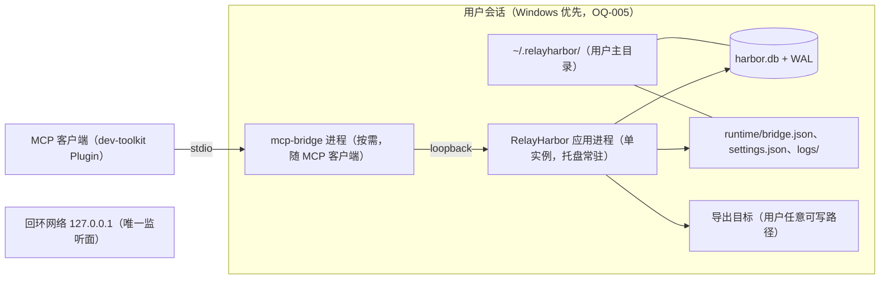

# 部署

> 状态：草稿
> 关联：CMP-001～008、NFR-001～007、CON-003/005/006

## 部署图

## 运行单元

- **RelayHarbor 应用进程** ×1：单实例互斥（CON-006）；承载前端 WebView2、
  ipc、http（回环监听）、services、domain、infra；
- **mcp-bridge 进程** ×0..N：随 MCP 客户端按需启动（每客户端一个），
  独立可执行文件，随 Plugin 分发；
- 无服务化组件、无自动扩缩需求（单用户桌面形态）。

## 网络区域与信任边界

- 唯一网络监听面：应用在 `127.0.0.1` 随机端口承载 MCP API（NFR-005），
  令牌鉴权（bridge.json 引导，每会话轮换）；
- 其余交互均为进程内（ipc → services）或本地文件（数据库、bridge.json、
  导出产物、日志）；
- WebView2 运行时为环境依赖（系统 webview，不捆绑 Chromium，CON-005）。

## 数据存储与备份

- 单一 SQLite `harbor.db`（WAL），仅应用进程写入（ADR-003）；
- 备份：`VACUUM INTO` 或应用退出后文件复制；禁止拷贝 WAL 活动库文件
  （NFR-004）；恢复操作有文档说明；
- 派生文件：导出物（INT-006）、日志（自动轮转）；丢失可重建，不需备份。

## 外部服务

- M1 无任何外部网络服务依赖（远程 Server 为未来形态，经应用转发）；
- 环境依赖：WebView2 运行时、Windows 外壳（托盘，OQ-005）。

## 配置与密钥

- `settings.json`：应用设置（主题、关闭行为），应用自管；
- `bridge.json`：端口 + 会话令牌 + pid + 协议版本，应用启动与令牌轮换时
  原子写出，文件权限仅当前用户；令牌不入 Plugin 配置、不随项目分发；
- 数据库无凭据（本地文件权限即边界）。

## 可用性与故障恢复

- 常驻策略：托盘常驻、关窗隐藏（CON-006），保障 MCP 通道存活；
- 故障恢复：
  - 应用崩溃：WAL 保证重启后库一致，最坏丢未提交变更（NFR-001）；
  - bridge 崩溃：MCP 客户端重启 bridge 即恢复（读 bridge.json 重连）；
  - 应用退出：bridge 下次调用时拉起（UC-009 A1），受 NFR-003 时限约束；
- 发布与回滚：应用独立安装升级；Schema 迁移自动执行且只向前（NFR-006），
  降级明确报错不静默损坏；升级前建议文件级备份。

## 监控入口

- 日志：`~/.relayharbor/logs/`，按会话区分、自动轮转，含错误、迁移记录、
  关键操作摘要与 MCP 工具调用（会话、工具、结果概要）（NFR-007）；
- 无远程遥测（本地安全边界，NFR-005）；健康判断以日志 + UI/工具调用
  行为为准。
