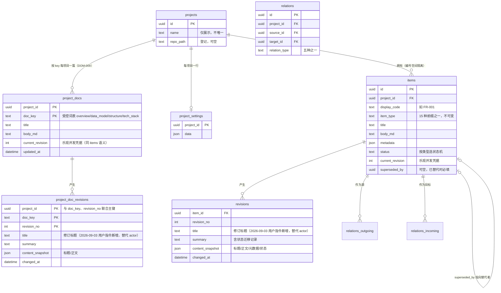

# 数据设计

> 状态：草稿
> 关联：DOM-001～008、CMP-006、ADR-002/003、INV-001～010

## 逻辑数据模型

概念对应：projects=DOM-001，items=DOM-002（含 DOM-006 任务与
superseded_by 字段），revisions=DOM-004，relations=DOM-003；
display_code 即 DOM-008。ChangeSet（DOM-005）不落表——它是端口操作
的参数，提交结果体现在 items/revisions/relations 的变更中。
project_docs / project_doc_revisions 为项目级文档（DOM-009）：
每项目每 key 一篇、Agent 经 MCP 修订、UI 只读；不入 items 体系——
无类型前缀（DOM-008 不适用）、无状态机、无关系，独立成表避免污染
15 类型清单与计数；修订同样不可变追加（BR-004 同规：无
UPDATE/DELETE），级联删除随项目（INV-010）。2026-09-04 修订循环由
project_overview 两表泛化而来（UI-035 概览成为 key=overview 的实例，
M1 未实现期改表零迁移）。

## 标识与约束

- 主键全部 UUID（内部）；对外引用用 `display_code`；
- `UNIQUE(project_id, display_code)`：数据库层兜底 INV-001（编号唯一）；
  "永不复用"由领域层保证——编号计数只增不减，删除/取消/替代不释放；
- `UNIQUE(source_id, target_id, relation_type)`：同向同类唯一（幂等基础）；
- `CHECK(relation_type IN ('derives','depends','satisfies','traces','relates'))`；
- 状态枚举不设 DB CHECK（状态机归属 domain，DB 只存文本）——白名单
  违规在领域层拒绝，避免两处维护；
- `superseded_by` 部分语义（已替代时必填、替代者非终态）由领域层在
  事务内校验（INV-006），DB 加可空外键。

## 引用完整性与删除策略

- 外键全部 `ON DELETE CASCADE`，服务于项目级联删除（INV-010、BR-011）
  的单事务执行；
- **关系两端同项目**（INV-003）由领域层在事务内校验——外键只能保证
  存在，无法表达"同 project_id"，不尝试用触发器实现；
- M1 无条目级物理删除入口（DOM-002 生命周期）；关系移除是显式操作
  （remove_relation），不级联其他数据；
- "替代"不删除：superseded_by 链接 + 终态保留。

## 状态、版本与审计字段

- `items.status`：与 03 状态模型一致（非 TASK：draft/in_review/confirmed/
  cancelled/superseded/deprecated；TASK：todo/doing/await_review/done/cancelled）；
- `items.current_revision`：乐观并发凭据（BR-005）；每次提交 +1；
- `revisions`：不可变追加表——无 UPDATE/DELETE 权限（迁移与测试断言），
  含 title（修订标题，2026-09-03 用户指令新增）、content_snapshot（完整
  内容快照，历史版本查看即读此列）、summary（含 `status: draft→in_review`
  类迁移记录）；操作者不入修订记录——原 actor 列同日用户指令移除，
  变更者审计由结构化操作日志承载（NFR-007，services.md CallContext）；
- 时间戳统一 UTC 存储（`changed_at`、`created_at`、`updated_at`）。

## 索引与规模假设

规模假设：万级条目 / 5 万级修订（NFR-002）。索引：

- `items(project_id, item_type, status)`：类型分组列表、看板过滤；
- `items(project_id, display_code)`：即唯一约束，编号精确读取；
- `revisions(item_id, revision_no)`：即主键，历史顺序读取；
- `project_doc_revisions(project_id, doc_key, revision_no)`：即主键，
  历史顺序读取；
- `relations(target_id)`：入边查询——影响定位与关联展开的遍历热点；
- `relations(source_id)`：出边查询。

搜索实现（FR-012 备注在此定案）：M1 用 LIKE（编号 `display_code` 精确或
前缀 + 标题/正文 LIKE），万级规模实测达标即止；不达标的升级路径是 FTS5
虚表 + 触发器同步，届时再迁移——不预建。

## 事务边界与并发控制

- 唯一写事务入口：`apply_change_set` / `transition_item` 等端口方法，
  内部 `BEGIN IMMEDIATE`（写锁即刻获取，避免死锁升级）、单事务完成
  OCC 校验 → 变更落库 → 修订追加（ADR-002）；
- 连接参数：WAL、`busy_timeout = 5000ms`、`foreign_keys = ON`；
- 读路径（UI 查询、MCP get_*）走只读连接，无锁竞争（WAL 快照读）；
- 单进程单写者（M1），端口语义不依赖此假设（expected_revision 机制
  对未来多入口仍然成立）。

## 迁移、归档与保留

- 迁移：sqlx migrations（`src-tauri/migrations/`，时间戳序，只增不改，
  NFR-006）；启动时自动执行，降级（新库旧应用）在迁移版本检查处明确
  报错；
- 修订不归档不清理（审计完整性优先于体积；万级条目 × 修订为 MB 级，
  SQLite 无压力）；
- 项目删除即全部数据终局（BR-011），无软删、无回收站——删除工具的
  confirm 参数与"建议先导出"提示是唯一防护（UC-002）。
