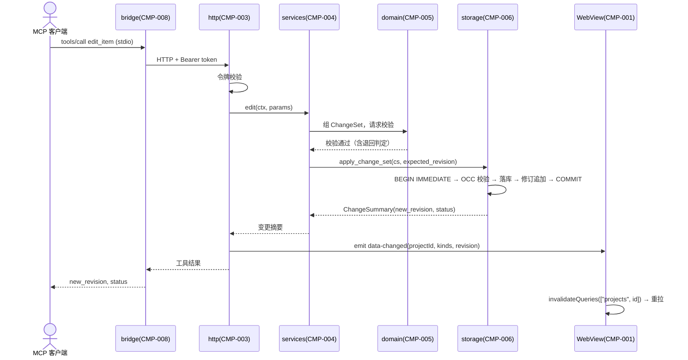

# SEQ-001 MCP 写入（ChangeSet 原子提交 + 事件发射）

> 状态：草稿
> 关联：UC-004/005/006、CMP-003/004/005/006/001、INT-002/001、ADR-002/006

## 场景与前置条件

Agent 经 bridge 调用任一写工具（edit_item 为例）；MCP 会话与令牌有效；
条目存在且非终态。

## 正常流程

## 失败与恢复

- OCC 冲突：事务内 0 行命中 → ERR_CONFLICT + 当前修订号，调用方取新
  后重组；库无变更；
- 规则拒绝（非法迁移/环/悬空/终态）：domain 校验在事务开始前失败，
  对应错误码 + 结构化 detail；
- 事务中断：整体回滚 → ERR_INTERNAL，可安全重试（无半写）；
- 令牌失效：401 → bridge 自动重发现一次（SEQ-002），重试原请求一次。

## 一致性和幂等

单事务原子（NFR-009）；事件在提交成功后、结果返回前发射——崩溃于
两者之间时事件丢失，UI 由聚焦刷新兜底（ADR-006 已记录此代价）。

## 可观测性

http 层记录工具调用审计（会话、工具、结果、耗时）；storage 层记录
事务摘要。
