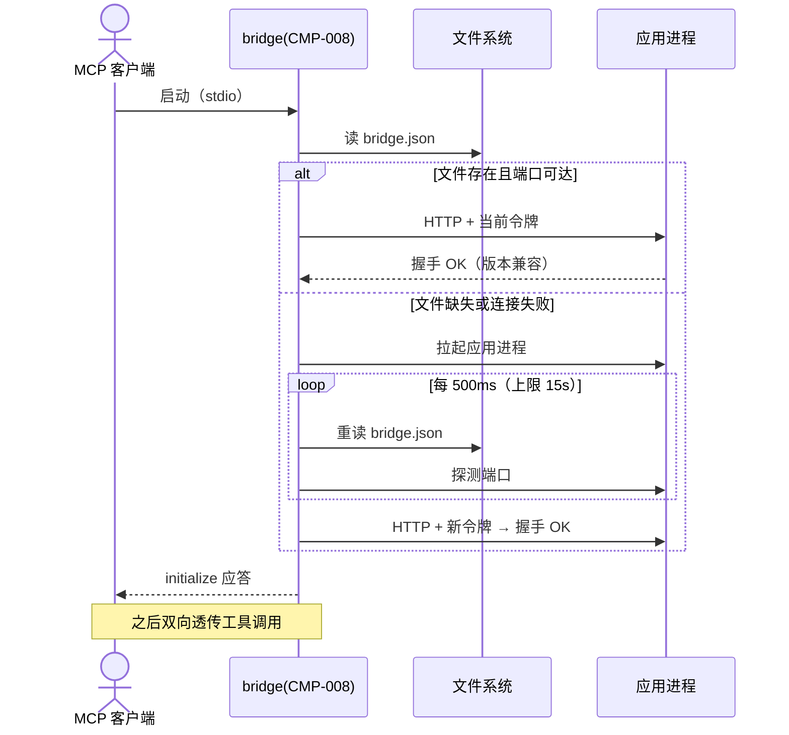

# SEQ-002 bridge 发现、拉起与令牌轮换恢复

> 状态：草稿
> 关联：UC-009、CMP-008/007/003、INT-005/002、ADR-005

## 场景与前置条件

MCP 客户端启动 bridge（stdio）；应用可能未运行、已重启（令牌已轮换）
或运行中。

## 正常流程

## 失败与恢复

- 15 秒未就绪：向客户端返回明确错误（应用启动失败的可读原因），
  bridge 保持存活等待客户端重试或退出；
- 令牌失效（应用重启轮换，运行中 401）：bridge 重走一次"读文件→
  必要时拉起→重试原请求"，仍失败才上抛 ERR_UNAUTHORIZED；
- 版本不匹配：握手即报 ERR_VERSION_MISMATCH，不进入透传（UC-009 A3）；
- 应用运行中退出：连接拒绝 → 同令牌失效路径自动恢复；排队上限 1 条
  其余快速失败。

## 一致性和幂等

bridge.json 原子替换写（INT-005），读到新旧任一完整版本；令牌以应用
侧校验为准，bridge 无缓存一致性问题（每次发现重读）。

## 可观测性

发现/拉起/重连事件写 stderr（stdout 保留给 MCP 协议），供 Plugin
侧日志采集。
