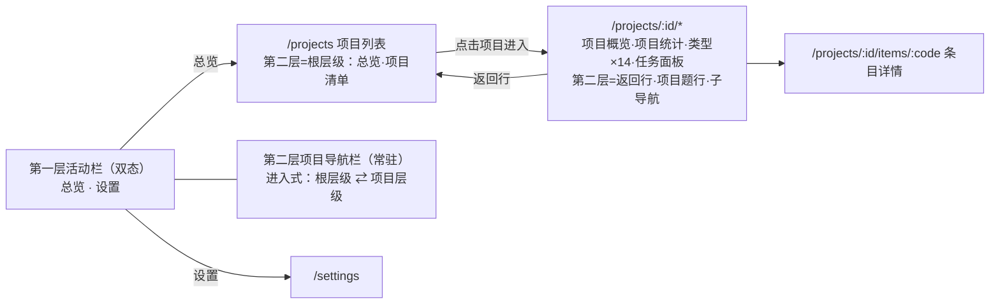

# 应用骨架（App Shell）

> 状态：待确认
> 关联：UI-001～007、FR-008/015/016/017、UC-010/017、ADR-006/007

## 骨架结构（UI-001/002）

双层导航 + 内容区（2026-08-29 用户指令确认：双层恢复、两栏内容不合并；
参考图的收起/展开仅作用于第一层活动栏）：

- **第一层（活动栏）**：汉堡切换双态（Fluent NavigationView）——
  - **收起（48px，默认）**：顶部汉堡按钮；「总览」图标；「设置」钉在
    底部；纯图标悬停 tooltip，当前位高亮（2026-08-29 用户指令：设置
    钉底，NavigationView footer 惯例）；
  - **展开（约 200px）**：图标 + 文字标签，「设置」同样钉底；汉堡
    按钮两态均为纯图标，不随展开加文字（2026-08-29 用户指令）。
  - **展开/收起动画**：宽度过渡约 250ms（durationGentle），两态统一
    减速曲线 curveDecelerateMid（2026-08-29 用户指令，快速启程、
    末端轻缓落定）；条目两态左锚定，
    动画期间图标与指示条不滑动，文字标签随宽度揭出。条目内容样式
    与面板宽度分开关：展开立即生效，收起延迟到宽度过渡结束
    （transitionend + 300ms 兜底）再切换，动画期间内容随面板被裁剪；
    系统开启「减弱动态效果」时降级为瞬时切换（2026-08-29 用户指令）。
  - **选中态**：NavigationView 指示条样式——条目左缘 3×16 品牌色
    圆角竖条 + 选中底色，图标保持中性前景色不染品牌色（2026-08-29
    用户指令）；字体与未选中项一致不加粗；图标统一 20px。指示条为
    单个共享元素：切换选中项时从当前位置位移到新条目，中途纵向
    拉长再收短（WAAPI 关键帧，时长 400ms = durationSlower，慢于
    宽度动画的 250ms，2026-08-29 用户指令；曲线同统一减速曲线），
    初次挂载直接就位。两态切换时指示条与图标的绝对
    位置恒定（条目左原点 6px、图标偏移 8px、指示条→图标间隙 5px
    不变），展开仅追加文字标签。
- **第二层（项目导航栏，停靠约 232px，常驻）**：进入式两级呈现
  （2026-09-02 用户指令重构：点击项目即进入该项目的侧栏上下文，
  顶部可返回；同一时刻只呈现一个层级。替代原「选中项目就地展开
  子导航」树形呈现——2026-08-29 就地展开与 2026-09-01「项目行自身
  不呈现选中态」条款随之消解；双层不合并、第二层常驻继续成立）。
  层级由路由派生（projectId 有无），不新增 UI 状态：
  - **根层级**（`/projects`，无项目路由上下文）：顶部「总览」全局位
    （全部项目列表页，当前态高亮）；「项目」分组清单：各项目名称 +
    条目/任务概况行，点击进入该项目（路由跳 `/projects/:id`，落地
    项目概览 index，UI-035）。
  - **进入层级**（`/projects/:id/*`）：顶部**返回行**（左箭头图标 +
    「返回列表」，Link 回 `/projects`，侧栏随之落回根层级——维持
    「侧栏反映路由」不变式；第一层「总览」亦可直接退出）；**项目
    题行**（项目名 + 条目/任务概况，非交互展示，不承载指示条与
    选中态）；**子导航**：项目概览（index，UI-035）/ 项目统计
    （2026-09-02 用户指令：原「概览」项拆分——原页更名项目统计移居
    `stats`，新增项目概览接管 index）/ 14 类型固定清单（每类型独立
    子页面 `items/type/:type`，无条目的类型同样常驻；原「条目」聚合
    入口 2026-09-01 用户指令移除——类型块扁平拆分；同日二次指令：
    UI-xxx 升格第 14 类型「界面设计」，插序 SEQ 之后）/ 任务（页面
    2026-09-01 用户指令更名「任务面板」）；导出 2026-08-28 用户指令
    移除改卡片弹出框；搜索 2026-08-28 用户指令暂缓移除；设计文档
    浏览入口 2026-09-01 新增、2026-09-02 用户指令暂缓回退（重议中，
    open-questions.md OQ-007）。
  不做可收起功能（2026-08-29 用户指令），设置页不显示（无二级导航）。
  **类型清单分组（2026-09-02 用户指令）**：14 类型按设计阶段
  （与 docs/design/ 目录 00→06 同构）以组头小字分隔——需求
  （FR/NFR/BR/CON）、用例（UC）、领域模型（DOM）、架构
  （CMP/INT/SEQ/ADR）、详细设计（UI）、验证（RISK/OQ）；TASK 与
  任务面板不入组置尾（用户指令）；组头为非交互小字行，不带计数，
  空组恒显示（与无条目类型常驻同策略，结构稳定）；组词表为工具
  级静态常量（随 INV-008 类型集合），非项目数据。
  **组间分隔线（2026-09-02 用户指令：先只加分隔线，不加粗、
  不编号）**：每个组头行上方画一条 hairline 分隔线
  （1px colorNeutralStroke2，与侧栏右缘边框同色）；通栏太长
  （同日二次指令收短）——线两端各缩进 16px（margin L），左端与
  组头文字/条目左缘对齐、右侧对称留白，宽约 166px；TASK 尾部
  两行不加线。
  **选中态**：与第一层同款左缘 3×16 品牌色竖条 + 选中底色，字体
  不加粗（颜色/圆角统一按第一层口径）。指示条为单个共享元素并带
  位移动画（2026-09-01 用户指令：与第一层动画一致）——切换当前项时
  从原位置滑向新条目、中途纵向拉长再收短，动效参数与第一层共用
  （WAAPI 400ms = durationSlower、统一减速曲线，实现落
  `app/layout/indicatorMotion.ts`）；根层级「总览」与进入层级子导航
  缩进不同，位移为 X+Y 双轴插值；选中态只落在当前路由对应项，
  返回行与项目题行不呈现选中态、不承载指示条（2026-09-02 用户
  指令）；初次挂载直接就位，系统开启「减弱动态效果」时降级为瞬时。
  **条目入场动画（2026-09-02 用户指令）**：层级进入（根 ⇄ 进入、
  设置页往返重挂）时条目行/组头/题行自上而下逐项浮现一次（淡入
  + 8px 上移，200ms、逐项错开 16ms 钳制 240ms）；层内导航不重播；
  「减弱动态」直接呈现终态；指示条测布局位定位，不受动画干扰。
  动效参数与触发语义见 patterns.md「侧栏条目入场动画」。
- **内容区**：当前路由页面，占剩余宽度。

导航状态：

| 状态 | 呈现 |
| --- | --- |
| 第一层收起（默认） | 汉堡 + 「总览」（顶部）、「设置」（钉底），纯图标 + tooltip |
| 第一层展开 | 汉堡 + 「总览」「设置」图标 + 文字标签，设置钉底 |
| 第二层根层级（`/projects`） | 「总览」全局位 + 项目清单（点击进入），常驻 |
| 第二层进入层级（`/projects/:id/*`） | 返回行 + 项目题行 + 子导航，常驻 |
| 设置页 | 第二层隐藏（无二级导航） |

要点：

- 双层结构维持 2026-08-28 原方案，两栏内容不合并（2026-08-29 用户指令
  确认）；参考图的收起/展开仅作用于第一层活动栏（NavigationView
  compact/expanded），展开态存 Zustand（默认收起=纯图标）；
- 第二层项目导航栏常驻，无可收起功能（2026-08-29 用户指令移除 ◫）；
  呈现方式 2026-09-02 用户指令改进入式两级（见上），层级随路由派生；
- 「总览」= 项目列表页（FR-008 语义不变——浏览项目信息、打开进入
  项目）；
- 导出入口（2026-08-28 用户指令）：全局位与子导航的「导出」移除，
  导出收敛为项目列表卡片弹出框（UI-023 修订；UI-033 聚合导出移除）；
- 搜索入口（2026-08-28 用户指令）：子导航「搜索」暂缓移除，页面规格
  保留（UI-022，见 pages/search.md），能力与契约不变；
- 子导航切换即路由跳转（react-router），无状态残留；当前项目 id、
  第一层展开态存 Zustand（UI 态）。

## 启动与唤起行为（UI-005）

- **冷启动**：读取应用设置中的 `last_location`（projectId + 路由路径），
  存在且项目仍存在则直接恢复；否则落到 `/projects`（首次启动）。路由
  变化时更新 `last_location`（经 set_settings 持久化，UI 仅有的持久化
  写操作之一，与 FR-016/017 一致）；
- **托盘唤起**（FR-015/UC-017）：窗口为隐藏非销毁，React 状态存活，
  天然保留离开时位置，无额外逻辑；
- 二次启动唤起已有实例（单实例），同样回到隐藏前的位置。

## 主题与语言（UI-003/004）

- **主题**：三态——跟随系统（默认）/ 浅色 / 深色。FluentProvider 按
  设置与系统偏好解析为 `webLightTheme` / `webDarkTheme`，即时切换，
  持久化于应用设置（FR-016）；
- **语言**：三态——跟随系统（默认）/ 中文 / 英文。文案全量双语资源
  （zh/en），切换即时生效并持久化（FR-016 修订项）。条目内容为用户
  数据，不参与翻译。
- 两者的解析与提供放 `app/providers/`（AppProviders），组件树只消费。

## 窗口参数（UI-006/007）

- 系统原生标题栏：不自绘、无无边框装饰，拖拽/缩放/最大化行为交给平台
  （Tauri 默认）；
- 默认 1280×800，最小 1024×640，可自由缩放；信息密度取 Fluent v9
  常规档。**此两项为假设级默认**，实现期可调，不构成设计约束。

## 错误处理

- 路由无匹配：重定向 `/projects`；
- last_location 指向已删除项目：清除记录并回退 `/projects`。

## 测试要点

- 侧栏状态随路由正确切换（根层级 / 项目进入层级 / 设置隐藏三态）；
  项目清单点击进入，返回行落回根层级，子导航当前位高亮，条目详情
  按编号前缀高亮所属类型；
- 冷启动恢复与失效回退（项目已删除）；
- 主题/语言切换即时生效且重启保持。
