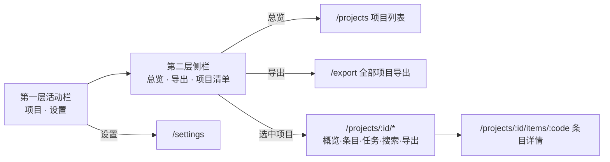

# 应用骨架（App Shell）

> 状态：待确认
> 关联：UI-001～007、FR-008/015/016/017、UC-010/017、ADR-006/007

## 骨架结构（UI-001/002）

双层侧栏，桌面工具型布局：

- **第一层（活动栏，窄）**：两个入口——「项目」（工作台）与「设置」。
  图标 + 文字提示；当前入口高亮；宽度固定约 48px。
- **第二层（侧栏）**：三段（2026-08-28 用户指令重构，取代原「下拉切换器
  + 随状态切换导航」双形态）——
  - 顶部全局位：「总览」（全部项目列表页 `/projects`）与「导出」（全部
    项目导出 `/export`，UI-033）；
  - 「项目」分组清单：各项目名称 + 条目/任务概况行（UI-010 轻量入口的
    就地形态），点击即进入该项目，取代原下拉切换器；
  - 选中项目在其行下就地展开子导航：概览 / 条目 / 任务 / 搜索 / 导出。
- **内容区**：当前路由页面，全宽渲染。

侧栏状态：

| 应用状态 | 第二层呈现 |
| --- | --- |
| 未选项目（`/projects`、`/export`） | 全局位高亮当前位；项目清单全部收起 |
| 已选项目（`/projects/:id/*`） | 该项目行展开子导航，当前位高亮 |
| 设置（`/settings`） | 无（设置无二级导航） |

要点：

- 「总览」= 项目列表页（FR-008 语义不变——浏览项目信息、打开进入
  项目）；原顶部下拉切换器由项目清单就地取代，概况速览直接可见；
- 「导出」全局位面向全部项目（UI-033），与项目子导航内的单项目导出
  （UI-023）并存，语义不同；
- 子导航切换即路由跳转（react-router），无状态残留；当前项目 id 存
  Zustand（既有 UI 态）。

## 启动与唤起行为（UI-005）

- **冷启动**：读取应用设置中的 `last_location`（projectId + 路由路径），
  存在且项目仍存在则直接恢复；否则落到 `/projects`（首次启动）。路由
  变化时更新 `last_location`（经 set_settings 持久化，UI 仅有的持久化
  写操作之一，与 FR-016/017 一致）；
- **托盘唤起**（FR-015/UC-017）：窗口为隐藏非销毁，React 状态存活，
  天然保留离开时位置，无额外逻辑；
- 二次启动唤起已有实例（单实例），同样回到隐藏前的位置。

## 主题与语言（UI-003/004）

- **主题**：三态——跟随系统（默认）/ 浅色 / 深色。FluentProvider 按
  设置与系统偏好解析为 `webLightTheme` / `webDarkTheme`，即时切换，
  持久化于应用设置（FR-016）；
- **语言**：三态——跟随系统（默认）/ 中文 / 英文。文案全量双语资源
  （zh/en），切换即时生效并持久化（FR-016 修订项）。条目内容为用户
  数据，不参与翻译。
- 两者的解析与提供放 `app/providers/`（AppProviders），组件树只消费。

## 窗口参数（UI-006/007）

- 系统原生标题栏：不自绘、无无边框装饰，拖拽/缩放/最大化行为交给平台
  （Tauri 默认）；
- 默认 1280×800，最小 1024×640，可自由缩放；信息密度取 Fluent v9
  常规档。**此两项为假设级默认**，实现期可调，不构成设计约束。

## 错误处理

- 路由无匹配：重定向 `/projects`；
- last_location 指向已删除项目：清除记录并回退 `/projects`。

## 测试要点

- 侧栏状态随路由正确切换（全局位 / 项目展开 / 设置三态）；项目清单
  点击切换项目，子导航当前位高亮；
- 冷启动恢复与失效回退（项目已删除）；
- 主题/语言切换即时生效且重启保持。
